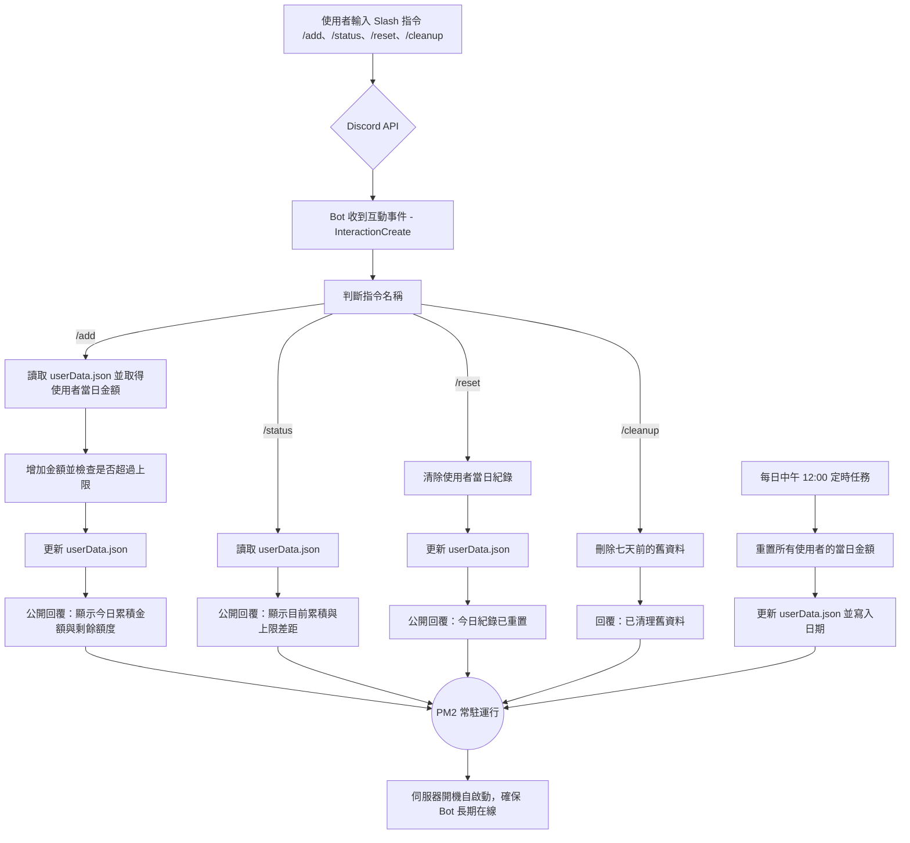

# 🐟 FishBot — Discord 機器人

## 💡 專案簡介
FishBot 是一個我自行開發並部署在 **Google Cloud Compute Engine (GCE)** 上的 Discord 機器人。  
它能協助伺服器中的成員以 `/add`、`/status`、`/reset` 指令管理每日金額累積，並限制每日上限。  
此專案從本地開發、版本控制（Git/GitHub）到雲端部署與長期運行，皆由我獨立完成。

---

## ✨ 功能特色
| 指令 | 功能說明 |
|------|-----------|
| `/add amount:<number>` | 新增金額到使用者今天的累積金額。 |
| `/status` | 查詢使用者當日累積與剩餘額度。 |
| `/reset` | 清空使用者當日的紀錄（重算或修正錯誤用）。 |
| `/cleanup` | 清理七天以前的舊資料，保持檔案精簡。 |

其他特色：
- 使用 `.env` 管理敏感資訊（如 Token、Guild ID、每日上限設定）
- 使用 `PM2` 讓機器人自動在開機後啟動並保持在線
- 支援每日中午 12:00 為日界線（依照台北時區）
- 所有回覆皆為公開訊息（非 ephemeral）
- 使用 `userData.json` 作為簡易資料儲存

---

## ⚙️ 技術架構
- **語言**：Node.js (v22)
- **框架 / 套件**：
  - [`discord.js`](https://discord.js.org/)
  - [`dotenv`](https://www.npmjs.com/package/dotenv)
  - [`pm2`](https://pm2.keymetrics.io/)
- **部署環境**：
  - Google Cloud Compute Engine (Debian)
  - nvm 管理 Node 版本
  - PM2 做進程常駐與自動啟動
- **版本控制**：
  - Git + GitHub  
  - 本地開發後 `git push`，VM 端使用 `git pull` 同步更新

---

## 🚀 部署與更新流程

### 🔧 初次部署
```bash
# 1. Clone 專案
git clone https://github.com/yusun1997/fish-bot.git
cd fish-bot

# 2. 安裝依賴
npm ci

# 3. 建立 .env 檔（放置 Token、Guild ID 等）
nano .env

# 4. 部署 Slash 指令
node deploy-commands.js

# 5. 使用 PM2 啟動
pm2 start index.js --name fish-bot
pm2 save
pm2 startup
```

---

### 🔁 後續更新
本地修改完功能後：
```bash
# 本地端
git add .
git commit -m "feat: 公開回覆 + /reset 指令"
git push origin main
```

雲端 VM 更新：
```bash
cd ~/apps/fish-bot
git pull
npm ci
node deploy-commands.js
pm2 restart fish-bot
```

---

## 💰 成本與預算控管
- 運行環境：Google Cloud Compute Engine (E2-micro)
- 平均費用：約 **$0.01 美金 / 天** ≈ **NT$0.32 / 天**
- 預估半年總成本：約 **$1.8 美金 / NT$58**
- 使用 GCP「預算與警示系統」設定每月 $4 上限，避免費用暴漲

---

## 🧩 專案學習重點
- 理解 **Discord API / Slash Command 註冊流程**
- 實作 `.env` 與 Node.js 應用環境變數管理
- 掌握 **PM2** 常駐應用與開機自啟
- 熟悉 **Git 工作流程**：`commit → push → pull → restart`
- 實際體驗 **雲端 VM 環境配置與成本控管**

---

## 🧠 未來改進方向
- 將資料改為使用 SQLite 或 MongoDB 儲存
- 加入 `/leaderboard` 排行榜功能
- 改用 **Docker + Cloud Run** 降低閒置成本
- 自動部署（GitHub Actions → SSH VM → restart）

---

## 📸 範例截圖
> Discord 中的實際回覆示意：  
> - `/add 100` → 「@YuSun 今天累積金額為 100 元」  
> - `/status` → 「距離上限還有 800 元」  
> - `/reset` → 「已清空你今天的紀錄」

---

